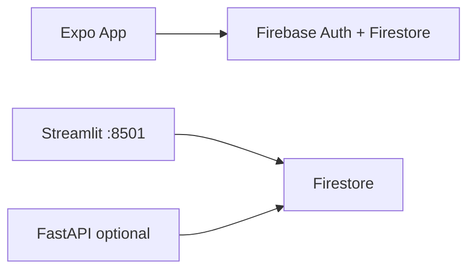

# Portfolio Manager — Mobile App

A Streamlit app cannot run natively on iOS/Android. This repo adds:

1. **`portfolio_core.py`** — shared business logic (Growth allocation, targets, etc.)
2. **`api/`** — FastAPI REST API (auth + Firestore)
3. **`mobile/`** — Expo (React Native) app for iOS and Android

The Streamlit app (`app.py`) is unchanged in behaviour; it now imports from `portfolio_core`.

## Architecture (mobile — Option B)



The **mobile app talks directly to Firebase** (client SDK + `EXPO_PUBLIC_FIREBASE_*`), like your expense app. No `uvicorn` required on the phone.

**Streamlit** still uses Firestore via the Python Admin SDK (`FIREBASE_CREDENTIALS_JSON` on the server).

See **[FIREBASE.md](FIREBASE.md)** and **`firestore.rules`**.

## Mobile app setup

```bash
cd mobile
cp .env.example .env
# Fill EXPO_PUBLIC_FIREBASE_* from Firebase Console → Project settings → Your apps
npm install
npx expo start
```

### Firebase Auth

1. Firebase Console → **Authentication** → enable **Email/Password**.
2. Create a user (or use an existing one from your other app).
3. Firestore rows use `username` (e.g. `admin`). Set `EXPO_PUBLIC_PORTFOLIO_USERNAME=admin` if your email is not `admin@...`.

### Firestore rules

Deploy `firestore.rules` from the repo root (no global `firebase` install needed):

```bash
cd /path/to/portfolio-rebalancing
npx firebase-tools login          # once per machine
npx firebase-tools deploy --only firestore:rules
```

Project id is set in `.firebaserc` (`expenseapp-df745` by default). To use another project: `npx firebase-tools use YOUR_PROJECT_ID`.

Alternatively: `npm install -g firebase-tools`, then `firebase deploy --only firestore:rules`.

Collections: `Portfolios`, `StockPurchases`, `Dividends`, `InvestmentLog` — each with document `data` and field `rows` (see FIREBASE.md).

### Optional: FastAPI

Only needed for Streamlit parity on a server or future features. **Not required for the Expo app.**

## Docker (optional)

`docker-compose.yml` includes a `portfolio-api` service on port 8000. Pass `FIREBASE_PROJECT_ID`, `FIREBASE_CREDENTIALS_JSON`, `ADMIN_PASSWORD_HASH`, and `COOKIE_KEY`.
